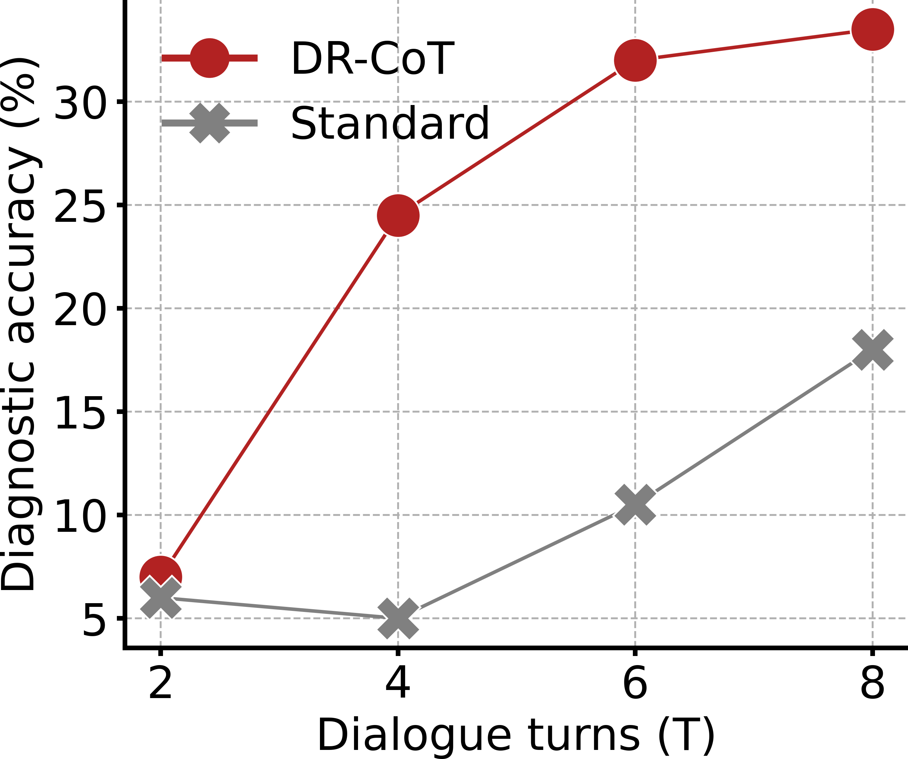
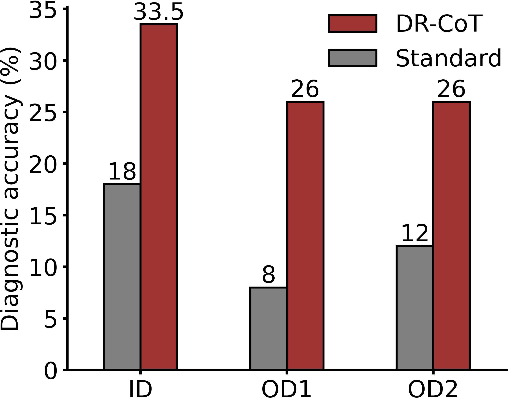

# Large Language Models Perform Diagnostic Reasoning

This repository contains the source code for the paper [Large Language Models Perform Diagnostic Reasoning](https://openreview.net/forum?id=N0lQfjeNWOE), which is accepted as a Tiny Paper at The Eleventh International Conference on Learning Representations (ICLR 2023) in Kigali, Rwanda. In this work, we propose DR-CoT prompting, which elicits the diagnostic reasoning ability of LLMs and exhibit striking empirical improvements for automatic diagnosis.

## Introduction

We explore the extension of chain-of-thought (CoT) prompting to medical reasoning for the task of automatic diagnosis. Motivated by doctors' underlying reasoning process, we present Diagnostic-Reasoning CoT (DR-CoT). Empirical results demonstrate that by simply prompting large language models trained only on general text corpus with two DR-CoT exemplars, the diagnostic accuracy improves by 15% comparing to standard prompting. Moreover, the gap reaches a pronounced 18% in out-domain settings. Our findings suggest expert-knowledge reasoning in large language models can be elicited through proper promptings.

<p align="center">
  
  
</p>

## Usage
WIP

## Citation
We will update the citation format once the paper is included in the proceedings.
```
@misc{
    wu2023large,
    title={Large Language Models Perform Diagnostic Reasoning},
    author={Cheng-Kuang Wu and Wei-Lin Chen and Hsin-Hsi Chen},
    year={2023},
    url={https://openreview.net/forum?id=N0lQfjeNWOE}
}
```